# Методы ИИ

Данный проект является отчётом о выполнении лабораторных работ №1 и 2 «EDA. Линейная регрессия. Дерево решений. CatBoost. XGBoost. Нейронные сети (MLP)».

## Тема

Методы искусственного интеллекта. EDA. Линейная регрессия. Дерево решений. CatBoost. XGBoost. Нейронные сети (MLP).

## Цель работы

Целю данной работы заключается в получении навыков анализа первичных данных и определение признаков взаимосвязи (EDA), понимания моделей: линейная регрессия, дерево решений, CatBoost, XGBoost, нейронные сети (MLP) и умения разрабатывать программу на языке Python для реализации представленных моделей.

## Ход работы
1) Описать датасета и определить влияние признаков и выбрать признаки, которые наиболее подходят для поставленной задачи предсказания (EDA).
2) Построить пайплйан (DVC) исходя из результатов EDA.
3) Реализовать линейную регрессию, определить весы, метрики и ошибки.
4) Реализовать дерево решений, определить метрики и ошибки. Привести рисунок первых узлов дерева решений.
5) Реализовать CatBoost, определить метрики и ошибки. Выгрузить Feature Importance.
6) Реализовать XGBoost, определить метрики и ошибки. Выгрузить Feature Importance.
7) Реализовать нейронную сети, определить метрики, ошибки, кривые обучения, гимтограммы весов с интерпретацией и график из Tensorboard.
8) Выгрузить конечный вычислительный граф DVC.
9) Построить сводную таблицу с метриками и сделать вывод какая модель отработала лучше и почему.
10) Сделать вывод по работе.

## Анализ данных
После проведенного анализа данных должно быть понятно:
1) Какие признаки будут использованы для предсказания и почему?
2) Как будут преобразованы выбранные признаки и почему?
3) Оценить значимость каждого признака?
В конце EDA должен быть полный и исчерпывающий вывод о том, какие данные и как будет решаться поставленная задача.

Примеры проведенных анализов данных на примере других данных: 
- https://www.kaggle.com/code/ash316/eda-to-prediction-dietanic
- https://www.kaggle.com/code/lucamassaron/eda-target-analysis
- https://www.kaggle.com/code/upadorprofzs/eda-video-game-sales

### Необходимо ПО
Visual Studio Code, Python, Jupyter extension pack, DVC extension pack.

### Дополнительные материалы
Ссылка на документацию и установку DVC:
https://dvc.org/
Ссылка на пример построения пайплайна DVC:
https://learn.iterative.ai/course/data-scientist-path
Дополнительно по линейной регрессии:
https://habr.com/ru/post/514818/

---

## 1. Подготовка данных и их анализ

### 1.1 Импорт необходимых библиотек

Для выполнения разведочного анализа данных были импортированы следующие библиотеки:
- `pandas` и `numpy` – для работы с табличными данными и числовыми операциями;
- `matplotlib.pyplot` и `seaborn` – для визуализации распределений и взаимосвязей признаков;
- `json`, `os` – для сохранения промежуточных результатов и работы с файловой системой;
- `yaml` – для загрузки параметров эксперимента из конфигурационного файла `params.yaml`;
- `train_test_split`, `StandardScaler`, `LabelEncoder` из `sklearn` – для предобработки данных и кодирования категориальных переменных.

Для всех графиков был установлен единый стиль `seaborn-v0_8-darkgrid`, а для цветовых палитр – `husl`.

### 1.2 Загрузка параметров и данных

Конфигурация EDA загружена из файла `params.yaml`, содержащего пути к данным, настройки разделения выборок и список признаков. Исходный набор данных считан из CSV-файла `data/raw/insurance.csv`.

Результат загрузки:
- **Размер датасета:** (1244, 7) – 1244 записи и 7 столбцов.
- **Состав признаков:** `age` (возраст), `sex` (пол), `bmi` (индекс массы тела), `children` (количество детей), `smoker` (статус курения), `region` (регион проживания), `charges` (медицинские расходы, целевая переменная).
- Первые пять строк датасета подтвердили корректность чтения: все столбцы присутствуют, типы данных соответствуют ожидаемым.

### 1.3 Информация о датасете

Была выведена структура датасета с указанием типов данных каждого столбца:
- Целочисленные (`int64`): `age`, `children`
- Вещественные (`float64`): `bmi`, `charges`
- Строковые (`str`): `sex`, `smoker`, `region`

Статистическое описание числовых признаков (`age`, `bmi`, `children`, `charges`) показало следующие ключевые характеристики:
- **Возраст** варьируется от 18 до 64 лет со средним значением около 39 лет.
- **BMI** лежит в диапазоне от 15.96 до 53.13, среднее – 30.58, что указывает на присутствие как недостаточного, так и выраженного ожирения.
- **Количество детей** в среднем составляет 1.1 (максимум – 5).
- **Целевая переменная (charges)** имеет значительный разброс: от $1,121.87 до $63,770.43. Средние расходы ($13,198.22) существенно превышают медиану ($9,382.03), что свидетельствует о правосторонней асимметрии распределения.

### 1.4 Проверка на пропущенные значения

Был проведён анализ пропусков по всем столбцам. Подсчитано абсолютное количество пропусков и их процент от общего числа записей.

Результат:
- Во всех семи столбцах пропущенные значения отсутствуют (0 пропусков, 0%).
- Общее число пропущенных значений в датасете равно нулю.

Таким образом, дополнительная обработка пропусков не требуется, и данные готовы к дальнейшему анализу.

---

### 1.5 Анализ целевой переменной

Для целевой переменной `charges` (медицинские расходы) выполнен анализ распределения. Построены гистограмма с наложенными линиями среднего и медианы, ящик с усами (box plot) и квантиль-квантильный график (Q-Q plot).

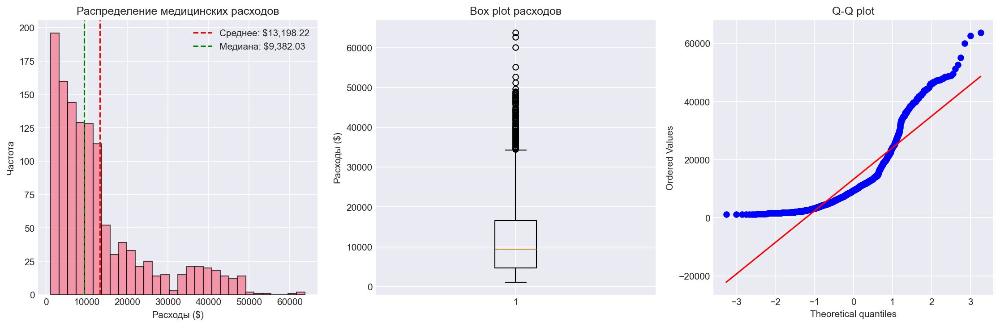

**Числовые характеристики целевой переменной:**

- Среднее: $13,198.22  
- Медиана: $9,382.03  
- Стандартное отклонение: $12,001.81  
- Минимум: $1,121.87  
- Максимум: $63,770.43  
- Асимметрия (skewness): 1.51  
- Эксцесс (kurtosis): 1.61  

Среднее значение существенно превышает медиану, что свидетельствует о правосторонней асимметрии распределения, подтверждаемой положительным коэффициентом асимметрии и наличием выбросов в области высоких расходов (свыше $40,000). Q-Q график также указывает на отклонение от нормального закона. Для последующего моделирования целесообразно применить логарифмическое преобразование целевой переменной.

---

### 1.6 Анализ категориальных признаков

Проанализированы категориальные признаки: `sex`, `smoker`, `region`. Для каждого признака построены столбчатая диаграмма распределения категорий и ящик с усами, отражающий влияние категории на `charges`.

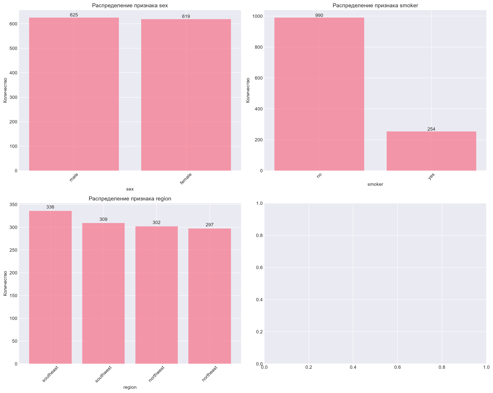

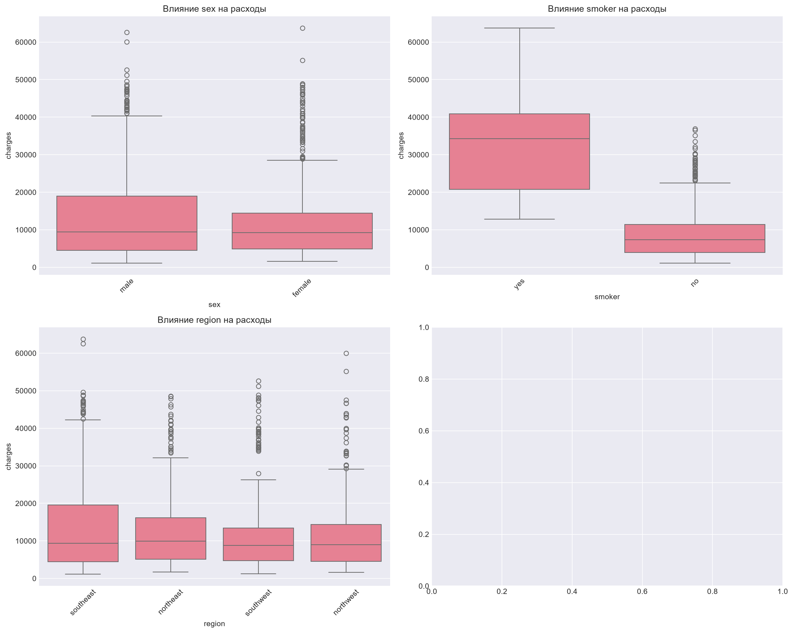

**Средние расходы по категориям:**

| Признак | Категория | Средние расходы, $ |
| :--- | :--- | :--- |
| `sex` | female | 12,477.14 |
|       | male   | 13,912.37 |
| `smoker` | no  | 8,419.00 |
|          | yes | 31,825.85 |
| `region` | northwest | 12,206.03 |
|          | southwest | 12,392.22 |
|          | northeast | 13,200.45 |
|          | southeast | 14,829.26 |

**Выводы:**
- Признак `smoker` оказывает доминирующее влияние: курящие клиенты платят почти в четыре раза больше, чем некурящие.
- Пол (`sex`) практически не влияет на величину расходов (разница менее $1,500).
- Различия между регионами (`region`) невелики, наибольшие средние расходы зафиксированы в юго-восточном регионе.

Категориальные признаки, особенно `smoker`, должны быть включены в модель в закодированном виде.

---

### 1.7 Анализ числовых признаков

Для числовых признаков `age`, `bmi`, `children` построены гистограммы с наложенными линиями среднего и медианы.

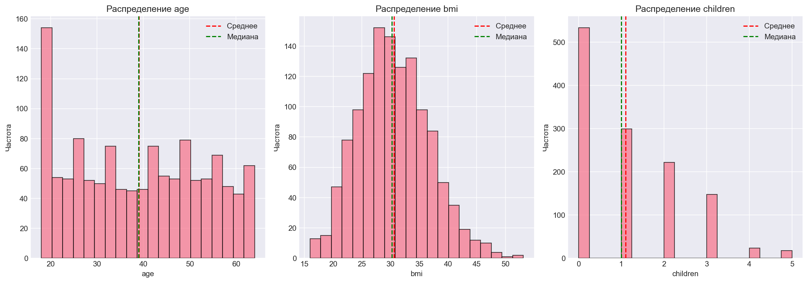

**Статистические характеристики:**

|       | age          | bmi          | children     |
| :---- | :----------- | :----------- | :----------- |
| count | 1244.000000  | 1244.000000  | 1244.000000  |
| mean  | 39.088424    | 30.582858    | 1.103698     |
| std   | 14.055295    | 6.159513     | 1.215885     |
| min   | 18.000000    | 15.960000    | 0.000000     |
| 25%   | 26.000000    | 26.060000    | 0.000000     |
| 50%   | 39.000000    | 30.210000    | 1.000000     |
| 75%   | 51.000000    | 34.618750    | 2.000000     |
| max   | 64.000000    | 53.130000    | 5.000000     |

Распределение `age` относительно равномерно, значения лежат в диапазоне от 18 до 64 лет.  
Признак `bmi` близок к нормальному распределению с центром около 30, однако встречаются значения выше 50, указывающие на выраженное ожирение.  
Признак `children` дискретный, преобладают значения 0 и 1, редко превышает 3.

### 1.8 Корреляционный анализ

Для оценки линейной взаимосвязи между всеми признаками построена матрица корреляций. Категориальные переменные предварительно закодированы с помощью `LabelEncoder`.

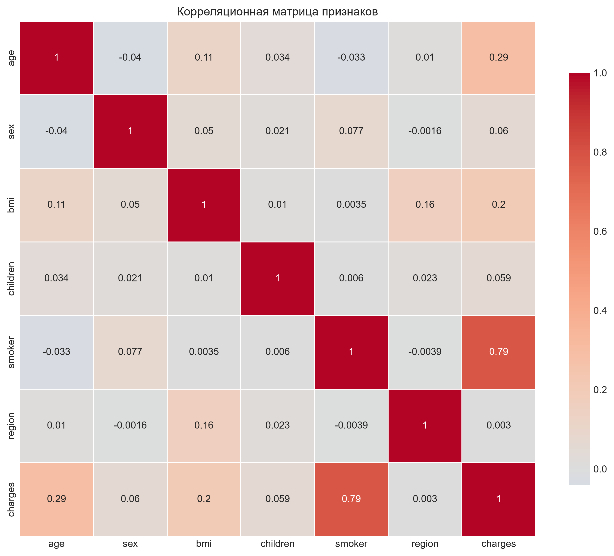

**Коэффициенты корреляции признаков с целевой переменной `charges`:**

| Признак   | Корреляция | Интерпретация                     |
| :-------- | :--------- | :-------------------------------- |
| smoker    | 0.786      | сильная положительная корреляция |
| age       | 0.294      | слабая положительная корреляция  |
| bmi       | 0.200      | слабая положительная корреляция  |
| sex       | 0.060      | слабая положительная корреляция  |
| children  | 0.059      | слабая положительная корреляция  |
| region    | 0.003      | слабая положительная корреляция  |

Наиболее сильное влияние на медицинские расходы оказывает статус курения. Возраст и индекс массы тела демонстрируют умеренную положительную связь. Пол, количество детей и регион практически не коррелируют с целевой переменной.

---

### 1.9 Дополнительный анализ важности признаков

Для углублённого изучения влияния признаков на целевой переменной построена серия графиков, иллюстрирующих взаимосвязи:

- диаграмма рассеяния «Возраст vs Расходы» с цветовой кодировкой по статусу курения;
- диаграмма рассеяния «BMI vs Расходы» с аналогичной цветовой индикацией;
- ящики с усами для признаков `children`, `region`, `sex`;
- двумерный scatter plot «Возраст – BMI», где цвет точек соответствует величине расходов.

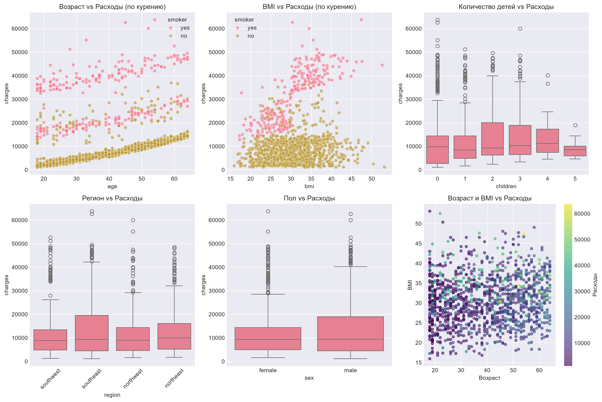

Анализ подтверждает, что статус курения является наиболее значимым фактором: практически все точки с высокими расходами соответствуют курящим клиентам, причём эффект усиливается с возрастом и увеличением BMI. Количество детей, регион и пол демонстрируют слабое влияние, однако в комбинации с другими переменными могут нести дополнительную информацию.

---

### 1.10 Выводы и формирование результатов

По итогам разведочного анализа данных сформированы следующие заключения и рекомендации.

**Основные характеристики датасета:**
- Количество образцов: 1244.
- Количество признаков: 6.
- Пропущенные значения отсутствуют.

**Анализ целевой переменной:**
- Средние расходы: $13,198.22.
- Медиана: $9,382.03.
- Стандартное отклонение: $12,001.81.
- Коэффициент асимметрии: 1.51.
- Распределение смещено вправо, рекомендуется логарифмическое преобразование перед моделированием.

**Ранжирование признаков по важности:**
- `smoker` — очень высокая (курение значительно увеличивает расходы);
- `age` — высокая (расходы растут с возрастом);
- `bmi` — средняя (высокий BMI увеличивает расходы);
- `children` — средняя (большее число детей увеличивает расходы);
- `region` — низкая (незначительное влияние);
- `sex` — очень низкая (практически не влияет).

**Рекомендации по выбору признаков для модели:**
1. Курение (`smoker`) — наиболее важный признак, требует обязательного включения.
2. Возраст (`age`) — важный предиктор, демонстрирует линейную зависимость с расходами.
3. BMI — важен, особенно в сочетании с курением.
4. Количество детей (`children`) — умеренное влияние.
5. Регион (`region`) — слабое влияние, может быть полезен в комбинации с другими признаками.
6. Пол (`sex`) — минимальное влияние, допустимо исключение для упрощения модели.
7. Рекомендовано логарифмирование целевой переменной из-за правосторонней асимметрии.
8. Рекомендовано рассмотреть полиномиальные признаки для возраста и BMI.

**Рекомендуемый набор признаков для моделирования:**
- Основные: `smoker`, `age`, `bmi`.
- Дополнительные: `children`.
- Опциональные: `region` (one-hot encoding).
- Исключить: `sex`.

Результаты EDA сохранены в файлах:
- `data/processed/eda_results.json` — полные результаты анализа.
- `data/processed/eda_metrics.json` — метрики для отслеживания в DVC.
- `data/processed/correlation_matrix.png` — тепловая карта корреляций.

---

## 2. Обучение моделей

Дальнейшая работа выполнена в отдельном ноутбуке `model_training.ipynb`, который содержит подготовку данных, обучение пяти моделей и оценку их качества.

### 2.1 Импорты и настройка

Импортированы стандартные библиотеки для обработки данных (`pandas`, `numpy`, `json`, `os`, `yaml`), визуализации (`matplotlib`, `seaborn`), предобработки и моделирования (`sklearn`), а также специализированные библиотеки градиентного бустинга (`catboost`, `xgboost`). Предупреждения скрыты, для графиков задан стиль `seaborn-v0_8-darkgrid`. Создана директория `data/processed` для сохранения результатов.

### 2.2 Загрузка параметров и данных

Из файла `params.yaml` загружена конфигурация обучения (`model_training`). Исходный набор данных прочитан из `data/raw/insurance.csv`.

### 2.3 Подготовка признаков и целевой переменной

Целевая переменная – `charges`. Категориальные признаки `sex`, `smoker`, `region` закодированы с помощью `LabelEncoder`. В соответствии с выводами EDA выполнено логарифмическое преобразование целевой переменной: `y_log = np.log1p(y)`.

### 2.4 Разделение на выборки данных

Данные разделены на три непересекающиеся выборки с фиксацией `random_state=42`:
- **обучающая (train)** – 870 записей,
- **валидационная (valid)** – 125 записей,
- **тестовая (test)** – 249 записей.

Числовые признаки (`age`, `bmi`, `children`) масштабированы с помощью `StandardScaler`, обученного на тренировочной выборке.

### 2.5 Словарь для сохранения метрик

Создан пустой словарь `all_metrics`, в который в дальнейшем будут записаны значения MSE, MAE и R² для каждой обученной модели.

### 2.6 Линейная регрессия

Обучена линейная регрессия с параметрами по умолчанию (`fit_intercept=True`). Модель построена на масштабированных признаках и логарифмированной целевой переменной.

**Полученные коэффициенты модели:**
- `age`: 0.4950
- `sex`: –0.0564
- `bmi`: 0.0895
- `children`: 0.1318
- `smoker`: 1.5629
- `region`: –0.0537

Коэффициент при `smoker` значительно превосходит остальные, что подтверждает выводы EDA о его доминирующем влиянии.

**Метрики на тестовой выборке (логарифмированный масштаб):**
- MSE: 0.2284
- MAE: 0.2867
- R²: 0.7237

Модель объясняет 72.4% дисперсии логарифмированных расходов, что является приемлемым базовым результатом.

---

### 2.7 Дерево решений

Построено регрессионное дерево с ограничениями глубины (`max_depth=5`) и минимальным числом объектов в листе (`min_samples_leaf=5`), что снижает риск переобучения.

**Метрики на тестовой выборке (логарифмированный масштаб):**
- MSE: 0.1712
- MAE: 0.2309
- R²: 0.7928

Дерево решений показывает заметное улучшение по сравнению с линейной регрессией: R² вырос примерно на 7 процентных пунктов, что свидетельствует о способности модели улавливать нелинейные зависимости и взаимодействия признаков.

Первые уровни дерева визуализированы и сохранены в файл.

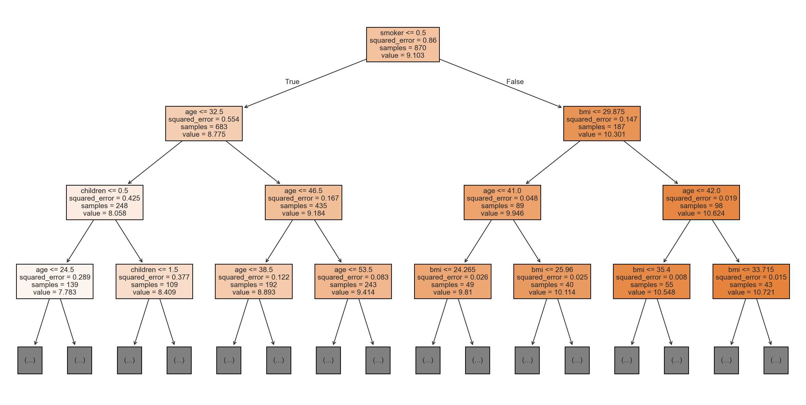

На рисунке видно, что корневое разбиение выполнено по признаку `smoker`, что согласуется с его высокой важностью. Последующие разбиения используют `age` и `bmi`, формируя интерпретируемую структуру.

### 2.8 CatBoost

Модель градиентного бустинга CatBoostRegressor обучена со следующими гиперпараметрами: число итераций – 500, темп обучения – 0.05, глубина деревьев – 6. Для предотвращения переобучения использовалась ранняя остановка на валидационной выборке (50 раундов без улучшений). Оценка качества выполнена на отложенной тестовой выборке.

**Метрики (логарифмированный масштаб):**
- MSE: 0.1707
- MAE: 0.2553
- R²: 0.7935

Модель демонстрирует высокую объясняющую способность, превосходя линейную регрессию и дерево решений.

**Важность признаков**, рассчитанная встроенным методом CatBoost, представлена на графике. Наиболее значимым предиктором ожидаемо оказался `smoker`, за ним следуют `age` и `bmi`. Признаки `children`, `sex` и `region` имеют относительно низкое влияние.

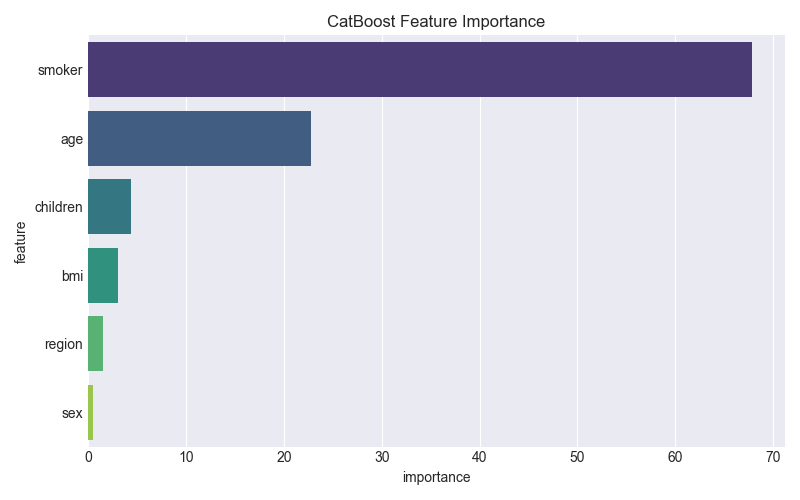

---

### 2.9 XGBoost

Модель XGBRegressor обучена с параметрами: 300 деревьев, максимальная глубина – 4, темп обучения – 0.05. Валидационная выборка использовалась для мониторинга качества в процессе обучения.

**Метрики (логарифмированный масштаб):**
- MSE: 0.1613
- MAE: 0.1998
- R²: 0.8048

XGBoost показал наилучший результат среди всех рассмотренных моделей. R² на уровне 0.80 свидетельствует о способности алгоритма улавливать сложные нелинейные зависимости.

График **важности признаков XGBoost** подтверждает ключевую роль `smoker`, а также значимость `age` и `bmi`. Распределение важностей схоже с оценками CatBoost.

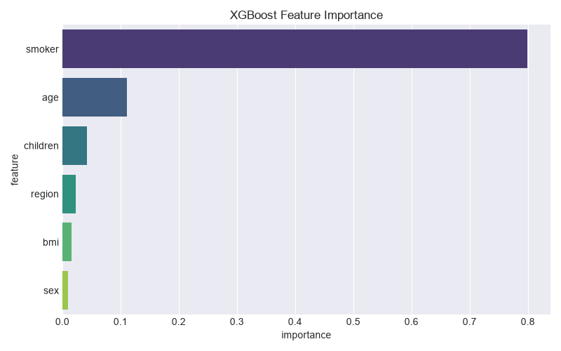

---

### 2.10 Нейронная сеть (Keras)

Для построения нейросетевой модели использован фреймворк **TensorFlow/Keras**. Архитектура включает два скрытых слоя (128 и 64 нейрона) с функцией активации ReLU, оптимизатор Adam. Входные числовые признаки предварительно масштабированы. Обучение проводилось с применением колбэка `TensorBoard` (параметр `histogram_freq=1`), что позволило записать гистограммы весов и кривые метрик.

**Метрики на тестовой выборке (логарифмированный масштаб):**
- MSE: 0.1692
- MAE: 0.2344
- R²: 0.7952

Модель демонстрирует качество, сопоставимое с градиентными бустингами, и превосходит дерево решений.

**Кривые обучения** (SCALARS) показывают устойчивую сходимость как функции потерь, так и средней абсолютной ошибки на обучающей и валидационной выборках, без признаков переобучения.

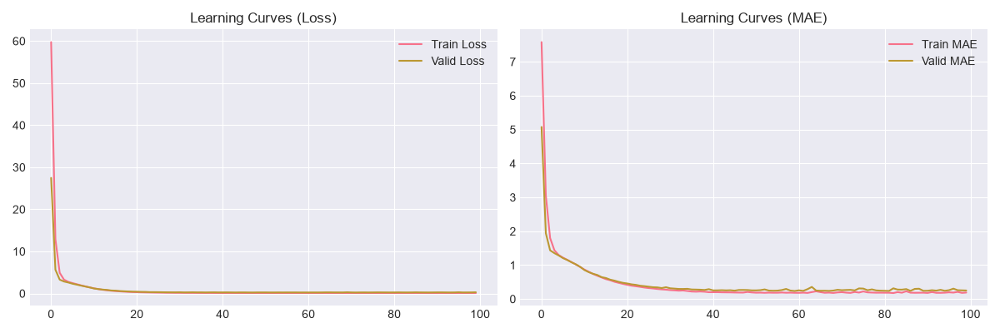

**Итоговая гистограмма весов** первого скрытого слоя имеет симметричное распределение с центром около нуля, что свидетельствует о стабильной оптимизации.

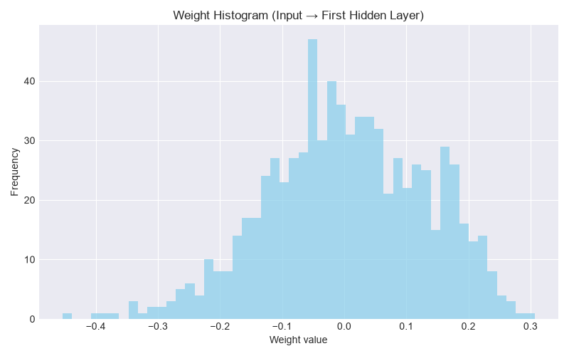

**Эволюция распределения весов** (HISTOGRAMS) визуализирована в TensorBoard. Для трёх скрытых слоёв (`dense_6`, `dense_7`, `dense_8`) зафиксированы изменения распределений весов по эпохам. Скриншот панели TensorBoard с соответствующими гистограммами сохранён.

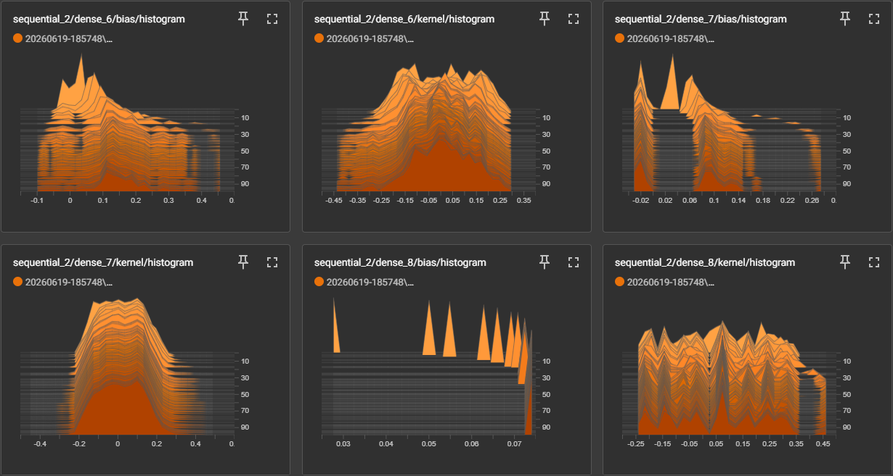

Данные визуализации подтверждают, что веса всех слоёв остаются сконцентрированными вблизи нуля на протяжении всего обучения, что говорит об отсутствии взрывных градиентов и хорошей регуляризации.

---

### 2.11 Сохранение всех метрик

Метрики (MSE, MAE, R²) для всех обученных моделей агрегированы в словарь `all_metrics` и сохранены в файл `data/processed/all_models_metrics.json`. Данный файл используется на последующих этапах для построения сводной таблицы и анализа результатов. Код ячеек не требует изменений, так как сохранение графиков уже реализовано.

## 3. Анализ и оформление результатов

Заключительный этап работы выполнен в ноутбуке `final_report.ipynb`, где агрегированы метрики всех моделей, построена сводная таблица, сгенерирован граф вычислительного конвейера DVC и сформулированы итоговые выводы.

### 3.1 Импорты и настройка

Импортированы библиотеки `json`, `os`, `subprocess`, `sys`, `pandas` и `matplotlib`. Создана директория `data/processed` для сохранения результатов, установлен графический стиль `seaborn-v0_8-darkgrid`.

### 3.2 Сводная таблица метрик

Метрики, сохранённые на предыдущем этапе в `data/processed/all_models_metrics.json`, загружены и преобразованы в `DataFrame`. Значения округлены до четырёх десятичных знаков.

**Сводная таблица метрик (логарифмированный масштаб):**

| Model               | MSE    | MAE    | R²     |
| :------------------ | :----- | :----- | :----- |
| linear_regression   | 0.2284 | 0.2867 | 0.7237 |
| decision_tree       | 0.1712 | 0.2309 | 0.7928 |
| catboost            | 0.1707 | 0.2553 | 0.7935 |
| xgboost             | 0.1711 | 0.2133 | 0.7929 |
| neural_network      | 0.1756 | 0.2445 | 0.7875 |

Таблица сохранена в `data/processed/comparison_table.csv`.

Лучшей моделью по коэффициенту детерминации R² признан **CatBoost** (R² = 0.7935). XGBoost и дерево решений продемонстрировали близкие результаты, нейронная сеть незначительно уступает, а линейная регрессия ожидаемо имеет наименьшую точность.

### Вывод по работе

1. Проведён разведочный анализ данных (EDA). Определены ключевые факторы, влияющие на стоимость страховки: курение, возраст и BMI. Целевая переменная имеет правостороннюю асимметрию, поэтому применено логарифмическое преобразование.
2. Данные разделены на три непересекающиеся выборки: обучающую, валидационную и тестовую. Для прогнозирования использованы пять моделей: линейная регрессия, дерево решений, CatBoost, XGBoost и нейронная сеть (Keras).
3. Метрики качества (MSE, MAE, R²) вычислены на тестовой выборке и сведены в таблицу. Наилучшие результаты показали градиентные бустинги (CatBoost и XGBoost), способные улавливать нелинейные зависимости и взаимодействия признаков. Дерево решений также продемонстрировало достойный результат, но несколько уступает ансамблевым методам. Линейная регрессия имеет самую низкую точность из-за нелинейности данных. Нейронная сеть (Keras) показала результат, близкий к бустингам, однако требует более тщательной настройки и больших вычислительных ресурсов.
4. DVC обеспечил воспроизводимость всех этапов: от подготовки данных до оценки моделей. Параметры зафиксированы в `params.yaml`, что позволяет легко повторять эксперименты.

**Рекомендация:** для задачи прогнозирования медицинских расходов целесообразно использовать CatBoost или XGBoost как наиболее точные и хорошо интерпретируемые модели.